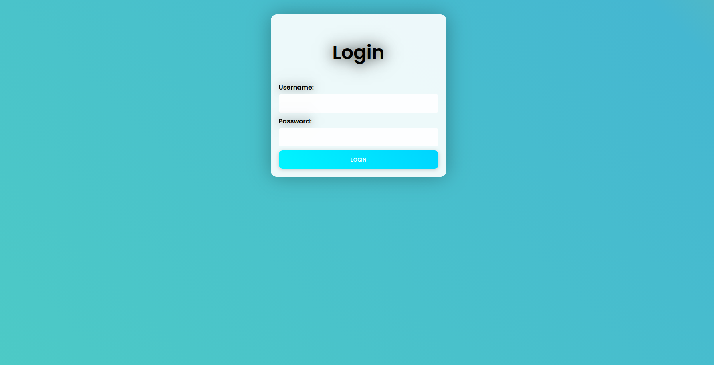
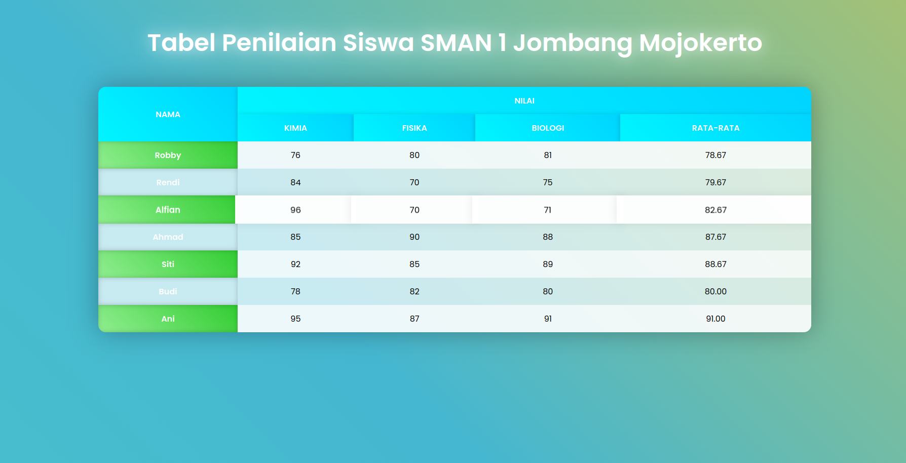

# 🚀 Web Programming - Week 2 Assignment

Proyek ini adalah tugas praktikum Minggu ke-2 untuk mata kuliah **Pemrograman Web**. Di sini, saya bereksperimen dengan CSS modern untuk menciptakan UI/UX yang menarik.

## ✨ Feature

Saya mencoba menerapkan beberapa sentuhan modern:

* **Sistem Login Simpel**: Form autentikasi untuk membatasi akses ke data nilai.
* **UI/UX yang Hidup**: Menggunakan *animated gradients*, efek *glassmorphism* (backdrop-filter), dan animasi *fade-in* agar transisinya terasa mulus.
* **Tabel Nilai Interaktif**: Menampilkan nilai Kimia, Fisika, dan Biologi lengkap dengan perhitungan rata-rata yang rapi.
* **Keamanan Dasar**: Halaman tabel dikunci menggunakan `sessionStorage`, jadi harus login dulu agar tidak bisa menembak URL langsung.
* **Layout Responsif**: Berkat Flexbox, tampilannya tetap proporsional di berbagai ukuran layar.

---

## 🛠️ Teknologi yang Digunakan

* **HTML5**: Untuk struktur fondasi halaman.
* **CSS3**: Sihir utama untuk animasi *keyframes*, bayangan, dan tata letak.
* **JavaScript**: Logika client side untuk validasi login dan pengalihan halaman.
* **Google Fonts**: Menggunakan font **Poppins** agar tipografinya terlihat modern dan bersih.

---

## 🚀 Cara Menjalankan Proyek

Kalau ingin mencoba menjalankannya di komputer lokal, ikuti langkah ini:

1.  Pastikan sudah punya Python.
2.  Buka terminal/command prompt dan masuk ke direktori proyek ini.
3.  Jalankan server lokal dengan perintah:
    ```bash
    python3 -m http.server 8000
    ```
4.  Buka browser dan akses: `http://localhost:8000/login.html`.
5.  **Gunakan kredensial berikut:**
    * **Username**: `admin`
    * **Password**: `password`

---

## 📸 Screenshot

| Halaman Login | Tabel Nilai Siswa |
| :--- | :--- |
|  |  |

---

## 📁 Struktur Folder

* `login.html`: Gerbang utama (form login).
* `tabel.html`: Halaman dashboard nilai (hanya bisa diakses setelah login).

---

**Dibuat oleh:**
**Ustu Bina Syahdiba** (5054241001)
*Tugas Pemrograman Web - Week 2*